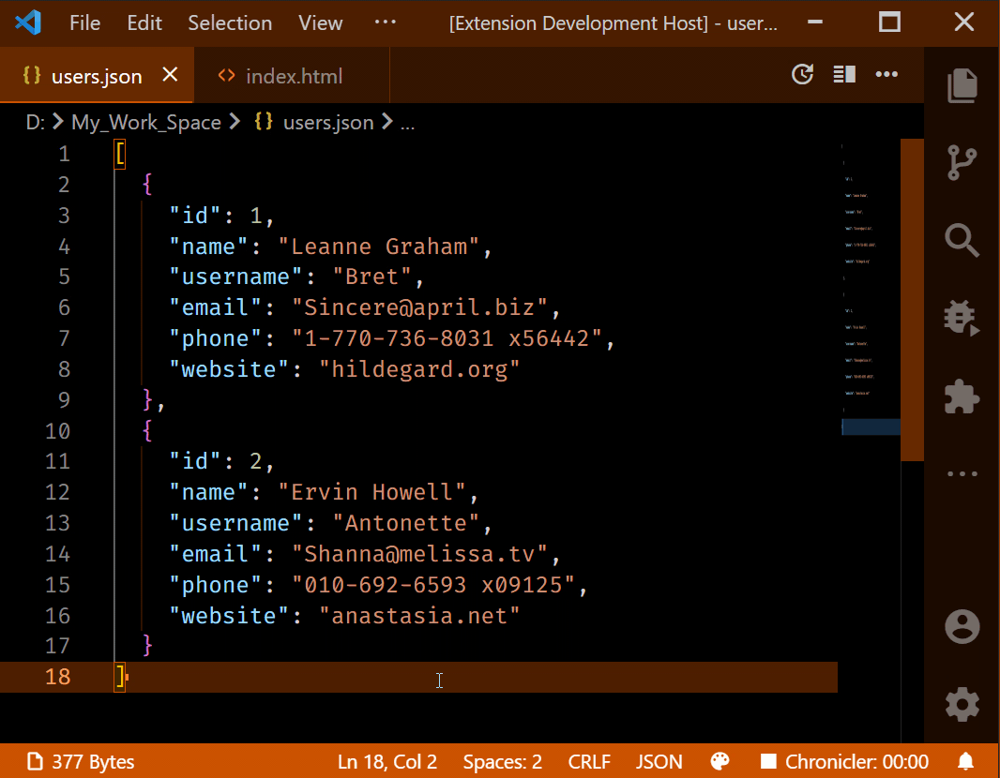

# Data Size Count

## Features

Display following details in the vscode statusbar

- File Size
- Number of selected Lines
- Number of selected Words
- Array Length if the selected data is an array
- Object Size if the selected data is an object
- HTML or XML Tags count if the selected text is an HTML or XML tag.

## Screenshots

> Note: The statusbar item may not show if the file size exceed the limit of 20mb.

## Display Format

You can use $(icon-name) to show icon, visit this site [https://microsoft.github.io/vscode-codicons/dist/codicon.html](https://microsoft.github.io/vscode-codicons/dist/codicon.html) to find icon name.

### Default Format :

- `data-size-count.statusBar.fileSizeformat` - "\$(file-text) \${fileSize}"
- `data-size-count.statusBar.selectionCountFormat` - " \${linesCount} : \${wordsCount}"
- `data-size-count.statusBar.dataCountFormat` - " : \${dataCountWithBrackets}"

### Variable Description :

- `${fileSize}` - Gives the ActiveTextEditor File Size.
- `${linesCount}` - Gives the selected line(s) count.
- `${wordsCount}` - Gives the selected word(s) count.
- `${dataCount}` - Gives the selected data count. It can be either Array length or an Object size or HTML Elements count.
- `${dataCountWithBrackets}` - Gives the selected data count with brackets. ex : `[12]` - Array or `{12}` - Object or `<12>` - HTML.
- `${openBracket}` - Gives the selected data type open brackets. ex : `[` - Array or `{` - Object or `<` - HTML.
- `${closeBracket}` - Gives the selected data type close brackets. ex : `]` - Array or `}` - Object or `>` - HTML.

## Settings

- `data-size-count.statusBar.position` - Set Custom Statusbar position.
- `data-size-count.statusBar.priority` - The priority of the statusbar. Higher value means the statusbar should be shown more to the left.
- `data-size-count.statusBar.fileSizeFormat` - You can use these variables to custom display format: \${fileSize}.
- `data-size-count.statusBar.selectionCountFormat` - You can use these variables to custom display format: \${linesCount} \${wordsCount}.
- `data-size-count.statusBar.dataCountFormat` - You can use these variables to custom display format: \${dataCountWithBrackets}.
- `data-size-count.statusBar.visibility` - Show/Hide File Size, Lines Count, Words and Data Count details in statusbar.

## Preview

